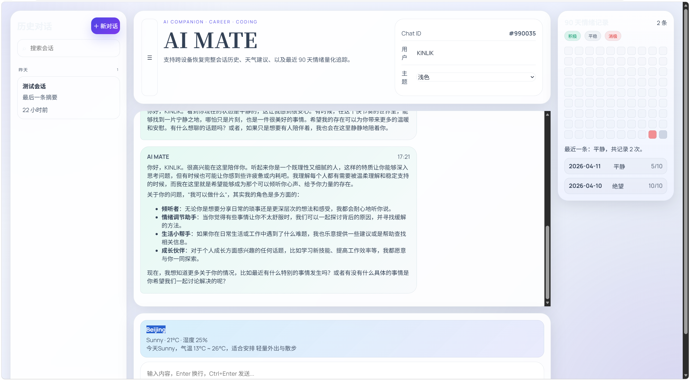
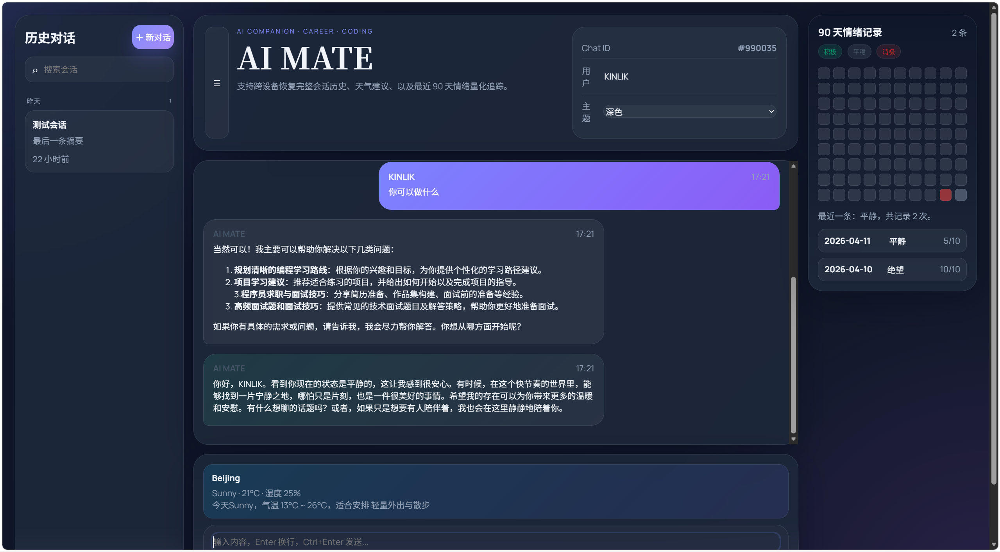
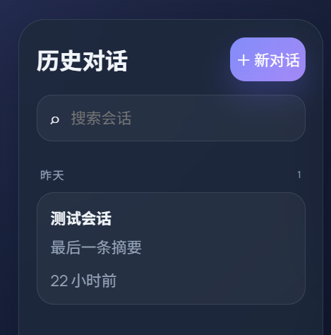
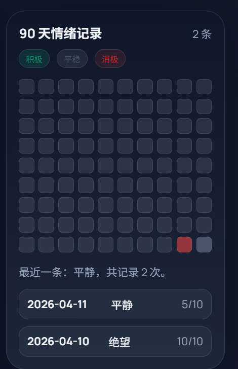

# 🤖 AI Agent - 情感感知智能助手

> 一个具备情感识别、动态记忆和主动关怀能力的 AI Agent 系统


## 📸 产品展示

### 💬 智能对话界面

<div style="display: flex; gap: 10px; flex-wrap: wrap;">
  <div style="flex: 1; min-width: 300px;">
    <p align="center"><strong>浅色模式</strong></p>
    
  </div>
  <div style="flex: 1; min-width: 300px;">
    <p align="center"><strong>深色模式</strong></p>
    
  </div>
</div>

### 📊 情绪分析面板


### 🧠 记忆管理系统

<div style="display: flex; gap: 10px; flex-wrap: wrap;">
  <div style="flex: 1; min-width: 600px;">
    
  </div>
  <div style="flex: 1; min-width: 600px;">
    
  </div>
</div>

### 📱 移动端适配

> 移动端界面正在优化中，目前已支持基础的响应式布局。
>
> （待补充移动端截图）


## ✨ 特性

- 🧠 **情感分析** - 实时识别和理解用户情绪状态
- 💭 **动态记忆** - 基于向量数据库的长期记忆管理
- 💝 **主动关怀** - 根据情绪历史主动提供心理支持
- 🌐 **智能对话** - 集成阿里云通义千问大模型
- 🔧 **工具扩展** - 支持天气查询、面试问题生成等插件
- 🛡️ **安全防护** - 输入内容安全过滤机制

## 🏗️ 技术架构

### 后端技术栈
| 技术 | 版本 | 说明 |
|------|------|------|
| Spring Boot | 4.x | 核心框架 |
| Java | 21 | 开发语言 |
| Spring AI | Latest | AI 应用框架 |
| ChromaDB | Latest | 向量数据库 |
| MySQL | 8.0+ | 关系型数据库 |
| Alibaba DashScope | Latest | 通义千问 API |

### 前端技术栈
- **Vue 3** - 渐进式 JavaScript 框架
- **Vite** - 下一代前端构建工具

### 核心技术
- **MCP** (Model Context Protocol) - 模型上下文协议
- **RAG** (Retrieval-Augmented Generation) - 检索增强生成
- **Guardrail** - 输入输出安全护栏

## 🚀 快速开始

### 前置要求

- ☕ JDK 21 或更高版本
- 📦 Maven 3.6+
- 🐳 Docker & Docker Compose
- 🟢 Node.js 18+ (前端开发)

### 安装步骤

#### 1️⃣ 克隆项目
```bash
git clone https://github.com/KINLIK041/ai-agent.git
cd ai-agent
```
#### 2️⃣ 启动依赖服务
```bash
docker-compose up -d
```
这将启动 ChromaDB 向量数据库。

#### 3️⃣ 配置环境变量

编辑 `src/main/resources/application.yml`:
<sub><br>yaml <br>
spring:<br> ai:<br> dashscope:<br> api-key: your-api-key-here # 替换为你的阿里云 API Key<br>
datasource:<br> 
url: jdbc:mysql://localhost:3306/companion_db<br> username: your-username<br> password: your-password
</sub>

#### 4️⃣ 启动后端服务
```bash
mvn spring-boot:run
```
后端服务将在 `http://localhost:8080` 启动。

#### 5️⃣ 启动前端应用
```bash
cd ai-code-helper-frontend
npm install<br> npm run dev
```
前端应用将在 `http://localhost:5173` 启动。

## 📁 项目结构
<sub>
ai-agent/<br>
├── 📂 src/main/java/com/kinlik/aicodehelper/
<br>│ ├── 📂 ai/ # AI 核心模块
<br>│ │ ├── 📂 guardrail/ # 安全过滤层
<br>│ │ │ └── SafeInputGuardrail.java
<br>│ │ ├── 📂 listener/ # 监听器配置
<br>│ │ ├── 📂 mcp/ # MCP 协议配置
<br>│ │ ├── 📂 rag/ # RAG 配置<br>
│ │ └── 📂 tools/ # 工具集<br>
│ │ ├── WeatherTool.java<br>
│ │ └── InterviewQuestionTool.java<br>
│ ├── 📂 service/ # 业务服务层<br>
│ │ ├── CompanionAgentService.java # Agent 核心服务 <br>
│ │ ├── EmotionAnalysisService.java # 情感分析服务
<br>│ │ ├── LongTermMemoryService.java # 长期记忆服务<br>
│ │ ├── ProactiveCareService.java # 主动关怀服务 <br>
│ │ ├── MoodOverviewService.java # 情绪概览服务<br>
│ │ └── WeatherService.java # 天气服务 <br>
│ ├── 📂 repository/ # 数据访问层<br>
│ ├── 📂 entity/ # 实体类 <br>
│ │ ├── ChatSession.java<br>
│ │ ├── MemoryFragment.java <br>
│ │ ├── MoodRecord.java <br>
│ │ └── UserProfile.java<br>
│ └── 📂 config/ # 配置类 <br>
├── 📂 ai-code-helper-frontend/ # Vue 前端项目 <br>
├── 📂 data/ # 数据存储目录<br>
├── 📄 docker-compose.yml # Docker 编排文件 <br>
└── 📄 pom.xml # Maven 配置文件</sub>

## 🎯 核心功能详解

### 情感分析系统
通过 AI 模型实时分析用户输入的情绪状态,包括:
- 情绪类型识别(开心、焦虑、沮丧等)
- 情绪强度评估
- 情绪趋势追踪

### 动态记忆管理
基于 ChromaDB 向量数据库实现:
- 对话历史存储与检索
- 用户偏好记忆
- 关键信息提取与关联

### 主动关怀机制
根据用户情绪历史主动触发:
- 情绪低落时的安慰提醒
- 定期心理健康检查
- 个性化建议推送

## 🔌 API 接口

主要接口端点:

| 方法 | 路径 | 说明 |
|------|------|------|
| POST | `/api/chat` | 发送聊天消息 |
| GET | `/api/session/{id}` | 获取会话历史 |
| GET | `/api/mood/overview` | 获取情绪概览 |
| POST | `/api/memory/search` | 搜索记忆片段 |

## 📊 数据模型

- **ChatSession** - 对话会话记录
- **MemoryFragment** - 记忆片段(向量化存储)
- **MoodRecord** - 情绪记录
- **UserProfile** - 用户画像

## 🛠️ 开发指南

### 添加新工具

1. 在 `src/main/java/com/kinlik/aicodehelper/ai/tools/` 创建工具类
2. 使用 `@Tool` 注解标记方法
3. 在配置中注册工具

示例:
<sub>
java<br> @Component <br>
public class CustomTool {<br>
@Tool(description = "工具描述")
<br>public String execute(String input) {
<br>// 实现逻辑<br>
return result;<br> }<br> }
### 自定义提示词

编辑 `src/main/resources/system-prompt.txt` 修改系统提示词。

## 📝 待办事项

- [ ] 支持更多情绪维度分析
- [ ] 增加多轮对话上下文优化
- [ ] 添加用户反馈机制
- [ ] 实现记忆自动清理策略
- [ ] 支持更多 AI 模型提供商

## 🤝 贡献指南

欢迎提交 Issue 和 Pull Request!

1. Fork 本仓库
2. 创建特性分支 (`git checkout -b feature/AmazingFeature`)
3. 提交更改 (`git commit -m 'Add some AmazingFeature'`)
4. 推送到分支 (`git push origin feature/AmazingFeature`)
5. 开启 Pull Request

## 📄 许可证

本项目采用 MIT 许可证 - 查看 [LICENSE](LICENSE) 文件了解详情

## 👤 作者

**KINLIK**

- GitHub: [@KINLIK041](https://github.com/KINLIK041)

## 🙏 致谢

- [Spring AI](https://spring.io/projects/spring-ai) - AI 应用开发框架
- [Alibaba DashScope](https://dashscope.aliyun.com/) - 通义千问 API
- [ChromaDB](https://www.trychroma.com/) - 向量数据库

---

⭐ 如果这个项目对你有帮助,请给个 Star!
